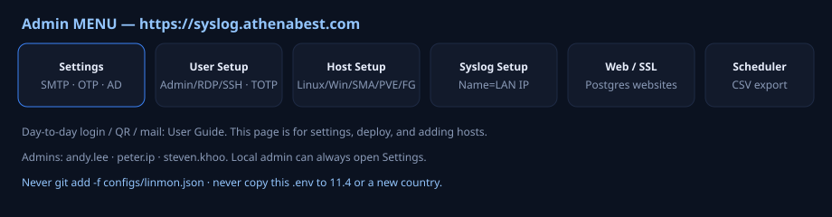
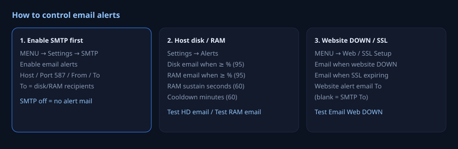

# LINMON Administrator Guide

For people who must **change settings**, not only log in.  
If you only need login / Authenticator / reading mail, use the **[User Guide](LINMON-USER-GUIDE.md)** first and practise there.

**Blueprint site:** https://syslog.athenabest.com  
**Server:** `192.168.3.200` · SSH **7788** · user `athenabest` · runtime **`/data/linmon`** (`/mnt/data1t` bind-mounted as `/data`). Leftover git tree `/home/athenabest/vide` — **do not `git pull`**.



---

## 0. Are you an admin?

On this site the AD names allowed to change setup are:

`andy.lee` · `peter.ip` · `steven.khoo`

plus the local user **`admin`**.

If **Host Setup** / **User Setup** / **Syslog Setup** are missing from MENU, you are **not** an admin. Stop and use the User Guide. Do not try to edit `linmon.json` by hand without reading section 2. How to use each MENU overlay: **§3b–3g**.

**RDP** and **SSH** are **separate** ticks. `calvin.leung` can use web Terminal but cannot open Host Setup.

---

## 1. Mental model (read once)

```
User browser  --HTTPS 443-->  nginx  -->  linmon :8080
Devices       --514 udp/tcp->  linmon  -->  Postgres device_log
Admin edits                  linmon.json (encrypted) + Postgres websites
```

- **https://syslog.athenabest.com** = humans.  
- **192.168.3.200:514** = FortiGate, QNAP, Winlog, Linux rsyslog.  
- Docker internal `172.16.0.20` = never type this in a device or browser.

Two other machines you may hear about:

| Name | Role | Runtime |
|------|------|---------|
| 3.200 / syslog.athenabest.com | Production | `/data/linmon` |
| 11.4 / scandoc-sg | Singapore | `/data/linmon` |
| 21.4 / syslog-4 | Extra syslog server | `/data/linmon` |

Never copy `.env` or `linmon.json` between sites. Servers **wget from GitHub** (`SERVER-INSTALL.sh` / `SERVER-UPDATE.sh`); they do not clone `vide`.

---

## 2. Files you must not destroy

| File | Commit to git? | If you lose it |
|------|----------------|----------------|
| `configs/linmon.json` | **NEVER** (`git add -f` is forbidden) | Hosts, SMTP, API keys, AD — gone or plaintext mess |
| `.env` → `LINMON_SECRET_KEY` | No | Encrypted passwords in json **cannot be decrypted** |
| `certs/fullchain.pem` + `privkey.pem` | No | nginx will **exit**; HTTPS down |
| `keys/` | No | SSH to Linux hosts fails |
| Postgres | n/a | Website list is **only** here, not in json |

Live config is **per machine**. The git file `configs/linmon.example.json` is a **template**, not production.

---

## 3. First-time admin on the website (after you can log in)

1. Open **https://syslog.athenabest.com** and complete login (User Guide §1).  
2. Left **MENU**. If you see **Host Setup** and **User Setup**, you are admin.  
3. Open **Settings**. Click **Save** only when you mean it. **Close** without Save discards the overlay.  
4. Prefer the UI over SSH-editing json unless the UI cannot do the job.

Left **MENU** is **nav only**. Each item opens a full-screen overlay. **Save** (or **Apply** / **Save policy**) writes; **Close** or click the dim background / Escape **discards** unsaved edits.

| MENU | What it changes | Where stored |
|------|-----------------|--------------|
| Host Setup | Linux / Windows / SMA / PVE / PBS / FortiGate | `linmon.json` |
| Web / SSL Setup | Website list + SSL/DOWN mail + Slack | **Postgres** `web_host` (not json) |
| Syslog Setup | FG / QNAP / SMA **name → LAN IP** | `linmon.json` `syslog.*_map` |
| Scheduler | CSV export + purge | `linmon.json` housekeeping |
| Display | Card layout / bars (this browser) | browser only |
| User Setup | 2FA policy, enroll, Admin/SSH/RDP ticks | `linmon.json` + enroll table |
| Settings | Poll, SMTP, OTP numbers, site name | `linmon.json` |

If Host / Web / Syslog / Scheduler / User Setup are missing, you are **not** Admin.

---

## 3b. MENU → Host Setup

1. MENU → **Host Setup**. Header: **+ Linux · + Windows · + SMA · + PVE · + PBS · + FortiGate · Save · Close**.  
2. Click the **+** for the kind you need. One row appears.  
3. Fill **Name**, **IP / Host**, **Port** (linux 22 / windows 3389 / SMA 8443 / PVE 8006 / PBS 8007 / FG 443), **User / Token**, **Password / API key** (blank = keep saved).  
4. **SSH keys (Admin only, v1.4.104+):** above the table, **Upload** a private key into **`/keys/`**. **Key path** is a **dropdown** — browse and pick a file from that folder (no typing). **Del** on a chip removes the file. Non-admins do not see Upload (API 403). Matching **public** key must already be on the target `authorized_keys`. Passphrase-protected keys are not supported. Blank Key path on Save = keep saved path.  
5. Tick **On**. **Log** = SSH journal on the 10‑min poll (not Windows Event Log).  
6. **HostKey +ssh-rsa** / **Pubkey +ssh-rsa**: only old OpenSSH after TCP already works. **Do not** tick to “fix” `i/o timeout`.  
7. Trash icon = delete that row (in the draft). **Save**. Wait for **Hosts saved**. Close.

**This linmon box itself:** IP **`172.17.0.1`** or `host.docker.internal`, never `192.168.21.4` / `.11.4` / `.3.200`. **Other machines keep real LAN IPs.**

PVE/PBS: run the public wget scripts on the Proxmox host first (§6.4). SMA API Keys = Administrator menu, not Services. Full API steps: install guide §5b. Linux SSH field-by-field: §6.1.

---

## 3c. MENU → Web / SSL Setup

Websites are **not** Host Setup. Stored in **this server’s Postgres** (DEV Windows ≠ PROD Ubuntu).

1. MENU → **Web / SSL Setup**.  
2. Environment label: **production** on 3.200; **development** only on a lab PC.  
3. **Email alerts (Website only):**  
   - Tick **Email when website DOWN** and/or **SSL expiring**.  
   - **SSL email if days left ≤** (default 30).  
   - **Website alert email To** — independent of disk/RAM SMTP To. Blank = Settings SMTP To. SMTP must still be enabled.  
   - **Test Email Web DOWN** — sample mail to that To.  
4. **Important alive → Slack:** tick Enable, paste Incoming Webhook, mention `U…` member ID or `@channel`. **Test Slack**. Does not need SMTP.  
5. Table: **+ Add site** (or **+ Company list** for samples). Name, **URL** (`https://…`), Note, **Imp** (Slack if DOWN), **On**. Trash deletes the row.  
6. **Save**. Close. Dashboard **Websites** section updates on next poll.

SSL colours: OK >30d · WARN ≤30d · CRIT ≤7d. Website To ≠ host disk mail.

---

## 3d. MENU → Syslog Setup

Fixes Docker rewriting syslog source to `172.16.0.1`. One line: `Name=192.168.x.x`.

1. MENU → **Syslog Setup**.  
2. **SMA syslog name → LAN IP** (AMC keys stay in Host Setup).  
3. **FortiGate map:** syslog **devname** = management IP. Optional default FG IP.  
4. **QNAP map:** RFC hostname = NAS IP. **Exact hostname** only (`metis-sg` must not match `Metis-SG-BDC`).  
5. **Save**. Applies immediately (no Docker rebuild). Devices must already send to **this linmon LAN IP:514**, not the website hostname.

HK blueprint lines: `athenabest-91g-hk=192.168.3.253`, `abhk-cpc-91=192.168.98.2`, `athenabest-214=192.168.3.214`. Do not paste HK maps onto 21.4.

---

## 3e. MENU → Scheduler

CSV export + optional purge. collect-log still every **10 minutes** (SSH ErrorCount + web backup); it does **not** write `device_log` unless you tick that box (leave **off** — use syslog).

1. MENU → **Scheduler**.  
2. Tick **Enable scheduler**. Tick **scheduled CSV export** and/or **Purge logs older than retain days**.  
3. **Frequency:** daily / weekly / monthly. **Time (local)**. Weekly → weekday. Monthly → day of month. **Keep logs (days)** e.g. 90.  
4. **Host path** e.g. `/data/exportlog` (3.200) or `/data/linmon-logs` (11.4). Must be under `/data` or `/mnt` (compose bind).  
5. **Split CSV by device type** (folders `windows/` `fortigate/` …). Optional combined CSV. Type checkboxes: none checked = all types.  
6. **Save**. **Test Export** writes a file now. **Test Housekeeping (dry-run)** counts deletes. **Test Purge (execute)** really deletes old rows — use carefully.

Prod path after `/data` bind: **`/data/exportlog`**. Changing a folder under `/data` or `/mnt` does not need `dc.sh`.

---

## 3f. MENU → Display

**This browser only** (not the server). Does not change other users’ screens.

1. MENU → **Display**.  
2. **Size & position:** cards per row, min width, page max width, gap, density, align.  
3. **Arrange:** Align all (equal size) · Reset sizes + order. Drag section list (Windows / Firewall / QNAP / Websites / Linux). Default sort (manual / name / status / …).  
4. **Page items / Host card items:** tick bars (SMA, PVE, Windows Event Log, …), hide header/footer, “only alarms/offline”.  
5. **Apply** (not named Save). **Reset** restores defaults. Close.

Drag card **headers** on the dashboard to reorder when sort is Manual.

---

## 3g. MENU → User Setup

Header: **Refresh · Close**. Policy is the **top checkbox row** + **Save policy**.

1. MENU → **User Setup**.  
2. Policy: Require OTP, Allow Authenticator, Allow YubiKey, Allow self-register, Login lockout, Local admin no lockout, **Local admin internal-only** (leave **off** behind Cloudflare), Max fails / Lock minutes. **Save policy**.  
3. **Yubico Client ID + API Secret** → Save policy **before** registering keys. https://upgrade.yubico.com/getapikey/  
4. **Register Authenticator:** type AD `sAMAccountName` · Type AD or Local admin · **+ Register Authenticator** → user scans QR → 6 digits → **Confirm Authenticator**.  
5. **YubiKey:** Click InKey box → touch key → **+ Register YubiKey** (does not remove Authenticator).  
6. Grid ticks **Admin / SSH / RDP** per user (independent). Local admin always has SSH+RDP.  
7. **Login lockouts:** Unlock / Unlock all.

Show Authenticator secrets = live 6-digit on the grid. Yubi OTP is never shown. Enroll detail: §5.

---

## 4. Settings — SMTP and alerts (so mail actually works)



### 4.1 Turn on SMTP (required for almost all mail)

**MENU → Settings** → scroll to **SMTP (IT email server)**.

1. Tick **Enable email alerts**. If this is off, disk, RAM, and website emails **do not send**.  
2. Fill (blueprint):

   | Field | This site |
   |-------|-----------|
   | SMTP host | `smtp.abagile.com` |
   | Port | `587` |
   | Username | as used on this server |
   | Password | type only to change; blank = keep |
   | From | `monitor@abagile.com` |
   | To | `it.helpdesk@athenabest.com` (comma-separated if several) |

3. Click **Save** (top of Settings). Wait for **saved** / OK message.  
4. Click **Test HD email**. Wait for helpdesk inbox (and spam).  
5. Click **Test RAM email** the same way.

If tests fail: host/port/firewall/credentials — not syslog.

**New country:** use **their** SMTP and **their** IT mailbox. Do not reuse abagile SMTP if that site cannot reach it.

### 4.2 When disk/RAM mail fires

Same Settings screen, **Alerts** card:

| Control | Blueprint | What it does |
|---------|-----------|----------------|
| Disk WARN / CRIT % | 80 / 90 | Card colour only |
| RAM WARN / CRIT % | 85 / 95 | Card colour only |
| Disk email when ≥ % | **95** | Send disk mail |
| RAM email when ≥ % | **95** | Send RAM mail |
| RAM must stay high (seconds) | **60** | Ignore 2-second spikes |
| Email cooldown (minutes) | **60** | Same host+kind will not mail every minute |
| Alert on offline / errors | On | Dashboard, not a separate email type |

**To stop disk mail without disabling SMTP:** raise Disk email % to 100, or remove that host’s disks from concern.  
**To stop all host mail:** untick Enable email alerts (OTP email also needs SMTP — do not turn it off lightly).

### 4.3 Website DOWN mail (different To)

**MENU → Web / SSL Setup** (not Host Setup).

1. Tick **Email when website DOWN**.  
2. **Email when SSL expiring** is **off** on this site (leave off unless you want cert mail).  
3. **Website alert email To:** `web_check@athenabest.com`  
   If you leave this **blank**, it uses SMTP To (helpdesk). This site **does not** blank it.  
4. **Save**.  
5. **Test Email Web DOWN** — must arrive in **web_check**, not helpdesk.

**Important** checkbox on a site + Slack webhook: extra Slack for those URLs. This site Slack is on, mention `#web-monitor`.

Website rows live in **Postgres**. Windows DEV and 3.200 are **different databases**.

---

## 5. OTP and User Setup (so staff can log in)

### 5.1 Policy (do this before blaming users)

**MENU → Settings → OTP / 2-step policy** **or** **User Setup** top checkboxes, then **Save policy**.

Blueprint:

- **Require OTP** = on (no second factor → no Dashboard)  
- **Allow Authenticator** = on  
- **Allow YubiKey** = on  
- **Allow self-register** = on  
- Local admin Email-OTP address = `it.helpdesk@athenabest.com`  
- TTL 300 seconds, max 5 attempts  
- **Login lockout** = on, **5** fails, **15** minutes  
- **Local admin no lockout** = on  
- **Local admin internal-only** = on (CF-Ray still allows this site)

**Yubico Client ID + Secret** (User Setup, two boxes):

1. Get keys from https://upgrade.yubico.com/getapikey/  
2. Paste Client ID and API Secret.  
3. **Save policy** at the top.  
4. Only then register keys.  

This site already has API keys. A new site without them: Yubi button may show, verify **fails**.

### 5.2 Enroll Authenticator for a user who cannot do it alone

Sit together. User has the phone app installed (User Guide §2.1).

1. **MENU → User Setup**.  
2. **Register Authenticator for:** type AD login, e.g. `jane.chan` (sAMAccountName, not email unless that is the sAM).  
3. **Type:** AD user (or Local admin for `admin`).  
4. **+ Register Authenticator**.  
5. A **QR** appears. User scans it.  
6. User reads **6 digits**. Type into **Code from Authenticator app**.  
7. **Confirm Authenticator**.  

If you skip Confirm, login will **not** offer Authenticator.

To enroll YubiKey: same username field → **Click here, then touch YubiKey** → **+ Register YubiKey**. This does **not** remove TOTP.

### 5.3 Admin / RDP / SSH lists

On User Setup, tick names independently:

| List | Meaning |
|------|---------|
| Admin | Settings, Host Setup, User Setup, … |
| RDP | Windows **RDP** button / web desktop |
| SSH | Linux **Terminal** button |

Do not make every AD user Admin. Copy this site: three admins; SSH may be a slightly larger set.

---

## 6. Host Setup — add a machine (slow, exact)

**MENU → Host Setup**. You see a **table**. Buttons on the right of the header: **+ Linux**, **+ Windows**, **+ SMA**, **+ PVE**, **+ PBS**, **+ FortiGate**, **Save**, **Close**.

**Blank Password / API key = keep what is already saved.** If you type a space you may overwrite. Leave the box empty unless you intend to change the secret.

Deleting an SMA row must also clear legacy **Syslog** `sma_url` / `sma_name` (the example template used HK `192.168.3.18`). Old builds resurrect that host after Save. v1.4.96+ clears it; on an old binary empty those fields in **Syslog Setup** or in `linmon.json`.

### 6.1 Add a Linux SSH host

1. **+ Linux**.  
2. **Kind** = linux.  
3. **Name** = short label (dashboard card).  
4. **IP / Host** = IPv4, e.g. `192.168.3.10`.  
5. **Port** = SSH port (`22` or `7788` like 3.200 itself).  
6. **User** = SSH user.  
7. **Key path** — **dropdown** of files in `/keys/` (Upload above first if empty). Target host must already trust the matching public key.  
8. **Password** = only if you do not use a key (blank = keep saved).  
9. **On** = ticked.  
10. **Log** = ticked only if you want SSH journal errors on the card (not syslog).  
11. Click **Save**. Wait for **Hosts saved**.  

The card appears after the next poll (up to **10 minutes**, Settings poll seconds = 600 here).

**Do not use this linmon server’s own LAN IP** (21.4: `192.168.21.4`, 11.4: `192.168.11.4`, 3.200: `192.168.3.200`). collect-log runs **inside Docker**; `dial tcp …:22: i/o timeout` is hairpin, not a bad password. **Other hosts on the LAN keep their real IPs** and work. The hint `HostKey +ssh-rsa` only matters **after** TCP connects (old OpenSSH) — do not tick it for a timeout. You do not need that tick on hosts that already SSH OK.

For the box that **runs** linmon:

| Host Setup IP | When |
|---------------|------|
| `host.docker.internal` | Preferred. collect-log needs `extra_hosts: host.docker.internal:host-gateway` (compose). |
| `172.17.0.1` | Docker bridge to the host (often works without compose change). |
| Own LAN IP | **Never** — timeout |

Or **omit** this machine from Host Setup and only collect rsyslog → `172.16.0.20:514` (see install guide §6b). Key path e.g. `/keys/id_ed25519` if you SSH with a key.

### 6.2 Add a Windows host (for RDP + Winlog matching)

1. **+ Windows**. Port **3389**. User `DOMAIN\user` or Domain column.  
2. Save.  
3. On the PC, install **Winlog** (public `linmon-winlog-setup.exe`). In Winlog Settings, syslog host = **`192.168.3.200`**, port 514.  
4. User who should click **RDP** must be in **User Setup → RDP**.

### 6.3 Add FortiGate API (CPU/RAM bars)

Create the API user **on the FortiGate**, then paste into linmon.

1. FortiGate GUI: **System → Administrators → Create New → REST API Admin**.  
   Username e.g. `linmon`. Profile **`super_admin_readonly`**. Trusted Host = **linmon server LAN IP**.  
2. Copy the **API key** (once).  
   CLI: `config system api-user` / `execute api-user generate-key linmon`.  
3. **Host Setup → + FortiGate**. Port **443**. User = API admin name. Password = API key. IP = **management** IP. Save.

Syslog still needs **Syslog Setup** `devname=IP` (e.g. `abhk-cpc-91=192.168.98.2`). Display name and syslog name may differ.

Full steps: **`docs/INSTALL-LINMON-SYSLOG-SERVER.md` §5b**.

### 6.4 SMA / PVE / PBS

**PVE and PBS have public scripts** — run those, do not create the token by hand. SMA has **no** script (GUI API Keys). Full wget: **`docs/INSTALL-LINMON-SYSLOG-SERVER.md` §5b**.

| Button | Create on the device | Port | Host Setup User | Password |
|--------|----------------------|------|-----------------|----------|
| + SMA | FortiAuthenticator **Administrators → API Keys** (not Services). Username **`API-USER`**. | 8443 | `API-USER` | AMC API key |
| + PVE | **Script** on the node: `install-pve-linmon-api.sh` → `linmon@pve!linmon` | 8006 | **full** `linmon@pve!linmon` | token secret (once) |
| + PBS | **Script** on PBS: `install-pbs-linmon-api.sh` → `linmon@pbs!linmon` | 8007 | `linmon@pbs!linmon` | token secret (once) |

```bash
wget -qO /tmp/install-pve-linmon-api.sh \
  https://raw.githubusercontent.com/andylee03/linmon-winlog/main/install-pve-linmon-api.sh
bash /tmp/install-pve-linmon-api.sh

wget -qO /tmp/install-pbs-linmon-api.sh \
  https://raw.githubusercontent.com/andylee03/linmon-winlog/main/install-pbs-linmon-api.sh
bash /tmp/install-pbs-linmon-api.sh
```

`--recreate` issues a **new** secret (old token deleted). Paste Token ID into Host Setup **User** (must include `!tokenid`). Blank password on later Save keeps the secret.

Full GUI/CLI and Pass/Fail: **`docs/INSTALL-LINMON-SYSLOG-SERVER.md` §5b**.

---

## 7. Syslog Setup — when the IP looks like 172.16.0.1

**MENU → Syslog Setup**.

Docker rewrites the sender. Map **device name = real LAN IP**, one per line:

```
Name=192.168.x.x
```

This site includes:

```
athenabest-91g-hk=192.168.3.253
abhk-cpc-91=192.168.98.2
athenabest-214=192.168.3.214
sma-8200v=192.168.3.18
```

**QNAP:** exact hostname only. `metis-sg` must **not** match `Metis-SG-BDC`.

Click **Save**. Devices must already send to **192.168.3.200:514**, not to the website URL.

---

## 8. Linux client in another office (not this server)

You are **not** installing LINMON. You only point rsyslog at the linmon **LAN IP**. Run INSTALL on the **client**, not on the linmon Docker host.

Installer **v1.0.2+** (public `andylee03/linmon-winlog`): default `--min err` forwards err/crit/alert/emerg **plus** `auth,authpriv.info` (sshd **Failed password** / **Invalid user**) and `kern.err`. Older clients that used `authpriv.notice` miss SSH login failures — **UPDATE** them.

### INSTALL (public wget — preferred)

Public **shell** (no PowerShell, no deploy key):

```bash
wget -qO /tmp/INSTALL.sh https://raw.githubusercontent.com/andylee03/linmon-winlog/main/INSTALL.sh
# HK:
sudo bash /tmp/INSTALL.sh --host 192.168.3.200 --port 514 --proto udp --min err
# SG (another Linux box, not 11.4 itself):
sudo bash /tmp/INSTALL.sh --host 192.168.11.4 --port 514 --proto udp --min err
# syslog-4 LAN clients (not on 21.4 itself):
sudo bash /tmp/INSTALL.sh --host 192.168.21.4 --port 514 --proto udp --min err
logger -p user.err 'linmon-syslog-test'
```

### UPDATE (public wget — preferred)

Always wget a **fresh** `UPDATE.sh` (do not reuse an old copy on disk):

```bash
wget -qO /tmp/UPDATE.sh \
  https://raw.githubusercontent.com/andylee03/linmon-winlog/main/UPDATE.sh
sudo bash /tmp/UPDATE.sh

# or one line:
wget -qO- https://raw.githubusercontent.com/andylee03/linmon-winlog/main/UPDATE.sh | sudo bash
```

That re-downloads `install-linux-syslog.sh` and re-applies `/etc/linmon-syslog.conf`.

If `/etc/linmon/github_deploy` exists but is **corrupt**, public `UPDATE.sh` may try private `--update` and fail with `Load key ... error in libcrypto` / `Permission denied (publickey)`. Fix:

```bash
sudo mv /etc/linmon/github_deploy /etc/linmon/github_deploy.bad
wget -qO /tmp/install-linux-syslog.sh \
  https://raw.githubusercontent.com/andylee03/linmon-winlog/main/install-linux-syslog.sh
sudo bash /tmp/install-linux-syslog.sh
sudo /usr/local/sbin/install-linux-syslog.sh --show   # expect script v1.0.2 + authpriv.info
```

Replace the deploy key later only if you still use the private USB pack / `linmon-syslog-update`.

If you install **on the linmon Docker host itself** (3.200 / 11.4 / **21.4**), `--host` = that machine’s LAN IP **drops** UDP (hairpin). Use `--host 172.16.0.20 --proto tcp`. Same for Host Setup SSH: never the own LAN IP (`192.168.21.4` on 21.4) — use `172.17.0.1`. Other hosts keep real IPs.

In **Logs**, pick **`linux (error)`**, not `linux`.

Full text: [INSTALL-LINUX-HOST-CLIENT.md](https://github.com/andylee03/linmon-winlog/blob/main/INSTALL-LINUX-HOST-CLIENT.md).

---

## 9. Deploy this server (when a developer says “new version”)

**GitHub only.** Do not `git pull` `vide`. Do not scp bins from the office PC. Do not `sudo`.

Use the public **`SERVER-UPDATE.sh`** (this is the server update script — **not** the Linux client `UPDATE.sh`):

```bash
wget -qO /tmp/SERVER-UPDATE.sh \
  https://raw.githubusercontent.com/andylee03/linmon-winlog/main/SERVER-UPDATE.sh
bash /tmp/SERVER-UPDATE.sh --dir /data/linmon
curl -skS https://127.0.0.1/api/version
# expect e.g. "1.4.102" — HTTP-only: curl -sS http://127.0.0.1/api/version
```

| Site | SSH | `--dir` | Check |
|------|-----|---------|--------|
| 3.200 | `athenabest` :7788 | `/data/linmon` | HTTPS `/api/version` |
| 11.4 | `athenabest` :22 | `/data/linmon` | |
| 21.4 | `metis` :22 | `/data/linmon` | |

Uses `~/.linmon/bin_deploy` to clone private `andylee03/linmon-bin`. When the stack is already up, UPDATE mainly **`docker cp`**s `linmon` / `collect-log` into the running containers (does not rebuild images).

**Compose / `/keys` (v1.4.102+ Upload SSH key):** pack compose uses `/keys:rw`. Stock UPDATE may leave an old `/keys:ro` on disk. If Host Setup **Upload** fails to write keys, sync compose from the pack clone and recreate, then UPDATE **again** (recreate resets the binary overlay):

```bash
cp -f ~/.linmon/bin-repo/docker-compose.yml /data/linmon/docker-compose.yml
mkdir -p /data/linmon/keys
cd /data/linmon && bash scripts/dc.sh up -d
bash /tmp/SERVER-UPDATE.sh --dir /data/linmon   # re-apply bins after recreate
grep keys /data/linmon/docker-compose.yml             # expect /keys:rw
```

HTTPS needs `ENABLE_HTTPS=1` and cert files; missing certs → nginx dies.

RDP record path: Settings saves `configs/rdp-record.env` only. Then `./scripts/dc.sh up -d`. Do **not** restart dockerd. Live folder: **`/data/docker/rdp-recording`** (same disk as `/mnt/data1t/docker/rdp-recording`).

---

## 10. New country LINMON **server** (copy process, new secrets)

1. New Ubuntu + Docker. wget **`SERVER-INSTALL.sh`** from `linmon-winlog` (install guide). New `LINMON_SECRET_KEY`. Copy **example** json, not 3.200 live json. First login **`admin` / `change-me`**.  
2. Put certs, enable HTTPS (or stay HTTP :80 until certs).  
3. Settings: OTP, SMTP, alerts **95% / 60s / 60m** like HK.  
4. Website To **separate** from IT To. SSL email optional (HK **off**).  
5. User Setup: few Admins; RDP/SSH as needed. Fill Yubico if you use Yubi.  
6. Host Setup + Syslog Setup with **that country’s IPs**. Do not SSH-poll the linmon host via its own LAN IP.  
7. Browser URL = that country’s HTTPS name. Devices :514 = that country’s linmon IP.  
8. Linux senders: public `INSTALL.sh --host THAT.IP` (not on the linmon host itself).

---

## 11. Do not

| Don’t | Why |
|-------|-----|
| `git pull` / `sudo git pull` on the server | Source stays on GitHub `vide`; servers wget **`SERVER-UPDATE.sh`** |
| scp bins from the office PC | Pack is private `linmon-bin` via deploy key |
| `git add -f configs/linmon.json` | Secrets in GitHub |
| Copy 3.200 `.env` to 11.4 / 21.4 | Wrong crypto key |
| Host Setup IP = this linmon’s LAN IP | Docker hairpin SSH timeout (`192.168.21.4` on 21.4) |
| Tick HostKey +ssh-rsa to “fix” i/o timeout | TCP never connected |
| Expose 514 on the public internet | Log injection / noise |
| Ship Go `winlog-setup` as the Windows installer | Use Inno pack |
| `taskkill` Winlog Settings from inside the form | UI hangs |
| Think Host Setup **Log** = Windows Event Log | Winlog → syslog |
| Put `.ps1` on a Linux client | Public install is **INSTALL.sh** |

---

## 12. Publish Windows vs Linux clients

| Product | Repo | Command (on a Windows office PC) |
|---------|------|-----------------------------------|
| Winlog | public `andylee03/linmon-winlog` | `.\scripts\pack-winlog-syslog.ps1` then `.\scripts\release-winlog.ps1` |
| Linux **INSTALL.sh / UPDATE.sh** | same public repo | source in `cmd/linux-syslog/pack/public/` + `scripts/install-linux-syslog.sh` — clients **wget** from `linmon-winlog` (no private key) |
| **Android APK** | same public repo | https://github.com/andylee03/linmon-winlog/releases/download/linmon-apk-v1.0.0/linmon.apk — sideload; pick site before sign-in; per-site fingerprint after first OTP (server ≥ 1.4.101). APK version independent of server. Not GitHub Latest. |
| Linux country USB (optional) | private `andylee03/linmon-syslog` | `.\scripts\pack-linux-syslog.ps1` → `dist\linmon-syslog\` (+ read-only deploy key). Prefer public wget for updates. |

---

## 13. If something is wrong (admin)

| Symptom | Check |
|---------|--------|
| No Host Setup in MENU | Your user is not in Admin list |
| Test email fails | SMTP Enable, host, To, firewall 587 |
| Disk mail missing | Threshold 95%; cooldown; Test HD email |
| Web mail in wrong inbox | Website To vs SMTP To |
| FortiGate “no API” | Host Setup + FortiGate row; syslog name ≠ display name; match by IP |
| FortiGate CPU always 0 | Need linmon **v1.4.92+** (resource/usage) |
| UPDATE `Permission denied (publickey)` | **Server:** `~/.linmon/bin_deploy` is `linmon-bin-deploy`, not `id_ed25519`. **Linux client:** broken `/etc/linmon/github_deploy` → move it aside and wget public `install-linux-syslog.sh` (§8) |
| Linux client misses SSH Failed password | Need installer **v1.0.2+** (`authpriv.info`); wget public `UPDATE.sh` |
| nginx down | Certs + `ENABLE_HTTPS=1` |
