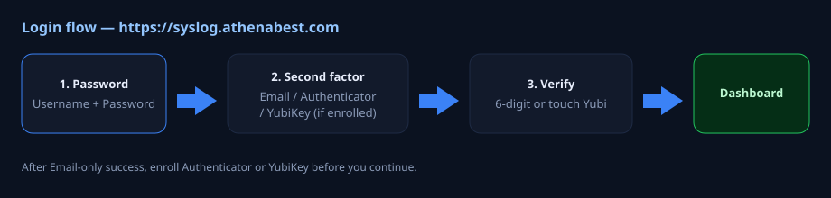
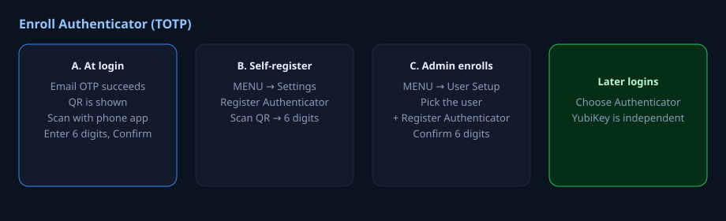

# LINMON User Guide

For people who have **never used this system**.  
Site: **https://syslog.athenabest.com** (Hong Kong production).

Administrators who add hosts, SMTP, and users: **[LINMON-ADMIN-GUIDE.md](LINMON-ADMIN-GUIDE.md)**.  
Linux computer that only *sends* logs: **[INSTALL-LINUX-HOST-CLIENT.md](INSTALL-LINUX-HOST-CLIENT.md)** (public wget INSTALL / UPDATE; installer **v1.0.2+** includes SSH Failed password via `authpriv.info`).  
**Android phone:** optional **LINMON APK** (§8) — same login as the browser, plus fingerprint / Face ID where the phone allows apps to use it.

---

## What is LINMON?

LINMON is a **web page** that shows whether servers, PCs, firewalls, and NAS boxes are healthy, and stores **syslog** (log messages they send).

On a PC you usually **only open a browser**. On Android you may also use the **LINMON APK** (sideload WebView — not Play Store).

| You | Use |
|-----|-----|
| IT staff | This User Guide: login, phone app (TOTP), read the dashboard, understand email |
| Admin | Admin Guide: add machines, SMTP, User Setup |
| Android | §8 — install APK, pick site, fingerprint after first OTP |
| A Linux server in another country | Linux host **client** install (rsyslog) — not this file |

---

## 0. Before you open the page

1. Use a **modern browser** (Chrome, Edge, Safari, Firefox).
2. Type exactly: **https://syslog.athenabest.com**  
   - Must be **https** (lock icon).  
   - If you type `http://` the site should jump to https by itself.  
   - Do **not** type `192.168.3.200` in the browser unless you are on the office LAN and someone told you to.
3. If the page never loads: you need office VPN or to be on the office network. Ask an admin. This is not a login password problem yet.
4. You need an **Active Directory** account (same as Windows PC login), for example `andy.lee`, **or** the rare local account `admin`. If you do not have either, you cannot log in — ask an admin to create AD access; do not guess passwords (lockout: 5 wrong tries → wait 15 minutes).

---

## 1. Login — click by click

### Step 1 — username and password

You will see a dark card titled **LINMON** and the line *Sign in with local admin or AD account*.

1. **Username**  
   - AD: usually `andy.lee` (not your email).  
   - You may also try `andy.lee@athenabest.com` if that is how your AD works.  
   - Local only: `admin`.
2. **Password** — your normal AD password (or the local admin password).  
   LINMON **does not save** this password in the browser on purpose.
3. Click **Login**.

**If you see an error**

| Message / behaviour | What to do |
|---------------------|------------|
| Wrong password | Check Caps Lock. After **5** failures you may be locked **15 minutes**. |
| Page does nothing | Wait; check you used https. |
| You never get to a second screen | OTP may be off (it is **on** at this site) or the account is locked. Ask admin. |

### Step 2 — “Password OK. Choose how to verify…”

You are not in yet. Pick **one** button (only buttons you already registered appear):

| Button you might see | Meaning |
|----------------------|---------|
| **Authenticator app** | 6 digits from Google or Microsoft Authenticator on your phone |
| **Email code** | A 6-digit code sent to your **AD mail** address (or `it.helpdesk@athenabest.com` for local `admin`) |
| **YubiKey** | USB key: click the big pad, then **touch the metal** once |

If you only see **Email code**, you have not finished Authenticator yet. You can still log in with email, then register the phone app (section 2).

Click **Back** if you typed the wrong user.

### Step 3a — Authenticator

1. Unlock your phone. Open **Google Authenticator** or **Microsoft Authenticator**.
2. Find the account named **LINMON** (or similar).
3. Read the **6 digits**. They change every 30 seconds. If they just changed, wait for a fresh number.
4. Type them in **Verification code**.
5. Click **Verify & sign in**.

Wrong code: wait for the next 30-second number. Do not keep guessing the same digits.

### Step 3b — Email code

1. Click **Email code**. The site sends mail.
2. Open the mailbox that belongs to your AD **mail** field (not a random Gmail unless that is what AD has). Local `admin` → **it.helpdesk@athenabest.com**.
3. Code is valid about **5 minutes** (300 seconds).
4. Type 6 digits → **Verify & sign in**.
5. **Resend code** if the mail did not arrive (check spam). You have **5** tries.

### Step 3c — YubiKey

1. Plug the key in (if it is USB).
2. Click **Click here, then touch YubiKey once**.
3. Touch the key **once**. Do not type anything. The code is hidden on purpose.
4. Wait until the page continues.

If this always fails: the site needs Yubico API settings (admins already filled them here). A new country site may not have that yet.

### You are in

You should see the **Dashboard**: coloured host cards, bars for FortiGate / QNAP / Windows, and a **MENU** on the left.

The session lasts **8 hours**. If you **close the browser**, you must log in again. After 8 hours you must log in again even if the tab stayed open.

---

## 2. Register Authenticator (TOTP) — first-time users

You need a phone app that shows changing 6-digit codes. This is **not** SMS.

### 2.1 Install the app (once)

On the phone, install **Google Authenticator** or **Microsoft Authenticator** from the official store. Open it. You do not need a Google/Microsoft “LINMON account” inside the app — you will **scan a QR**.

### 2.2 Path A — the site forces you after Email login

If you logged in with **Email only** and have no app and no YubiKey, you may see:

*You signed in with Email OTP only. You must register a second factor…*

1. Leave the tab **Authenticator** selected.
2. Wait until a **white QR square** appears (not “Loading QR…”).
3. In the phone app: **+** → **Scan QR code** → point at the screen.
4. The app shows **LINMON** and 6 digits.
5. Type those digits in **Authenticator code** on the computer.
6. Click **Confirm & continue**.

**New QR** if the square is missing or you waited too long.  
**Cancel / Logout** if you must stop — you still will not have a working app until you finish this.

If the camera cannot scan: an admin can read the **secret** text under the QR and you type it manually in the app (*Enter a setup key*).

### 2.3 Path B — you are already on the Dashboard

Anyone allowed to self-register (this site: **yes**):

1. Left side: click **MENU** if the drawer is closed. (There is **« Hide**; click the left edge or MENU to open again.)
2. Click **Settings**.
3. Scroll to **Authenticator app**.
4. Click **Register Authenticator**.
5. Scan QR on the phone → type 6 digits → confirm.

To remove it later: **Remove Authenticator** (you should enroll again before you rely on login).

YubiKey on the same Settings page is **optional** and **does not delete** Authenticator.

### 2.4 Path C — an admin does it for you

You sit with your phone next to an admin (`andy.lee`, `peter.ip`, or `steven.khoo`).

1. Admin opens **MENU → User Setup**.
2. **Register Authenticator for**: your AD name e.g. `andy.lee`. Type **AD user**.
3. Admin clicks **+ Register Authenticator**.
4. **You** scan the QR on **their** screen.
5. **You** read 6 digits; admin (or you) types them in **Code from Authenticator app**.
6. **Confirm Authenticator**.

Until Confirm succeeds, login will **not** show Authenticator.

### 2.5 Next time you log in

Choose **Authenticator app** instead of waiting for email. Keep the phone with you. If you get a new phone, ask an admin to register again **before** you wipe the old phone.

---

## 3. What you see after login (do not be afraid to click)

### 3.1 MENU (left)

| Item | Who | What it is |
|------|-----|------------|
| **Logs** | Everyone | Syslog lines (firewall, NAS, Windows, Linux) |
| **RDP Playback** | Admin | Replay recorded remote desktop |
| **Terminal Log** | Everyone with access | Who typed in web SSH / who opened RDP |
| **Login Logs** | Admin | Who signed in, success/fail |
| **Settings** | Everyone sees some; admin sees SMTP/OTP | Site name, mail, login policy |
| **Host Setup** | Admin | List of machines |
| **Web / SSL Setup** | Admin | Public websites to ping |
| **Syslog Setup** | Admin | Name → real IP (Docker NAT) |
| **Scheduler** | Admin | CSV export of logs |
| **Display** | Everyone | How big cards are, what to hide |
| **User Setup** | Admin | 2FA and who is Admin/RDP/SSH |

**Close** or **« Hide** does not log you out.

### 3.2 Dashboard cards

Each square is one **Linux or Windows** host from Host Setup.

- Green-ish / online = SSH or RDP reachable.  
- Red / offline = cannot connect (not the same as “no syslog”).  
- FortiGate / QNAP / Windows **bars at the top** are syslog devices. Click a name to open **Logs** for that device only.
- **Linux card (v1.4.109+):** **double‑click** the card (or click the green **Linux Syslog** box) → that host’s Logs. **Click the name** → expand detail.  
- **Windows:** click the Event Log box / PC name in the Windows bar → Event Logs.

**RDP** on a Windows row opens web remote desktop **only if** you are in the RDP user list.

Card “SSH journal errors (0)” with lots of Logs is normal: journal warning+ ≠ rsyslog volume (admins: Admin Guide **§3h**).

### 3.3 Logs

**MENU → Logs**.

- Pick device type if the page offers filters (FortiGate, **linux (error)**, windows, qnap…).  
  **linux** = SSH poll. **linux (error)** = rsyslog from `INSTALL.sh` (OS errors + SSH login failures on v1.0.2+ clients).  
- Search / time range if shown.  
- This is **not** email. One log line does **not** send mail.

---

## 4. Email you might receive (and what to do)

You do **not** turn these on yourself unless you are an admin. This section is so you **understand the mail**.

| Subject / kind | Why | Who gets it **on this site** | What you should do |
|----------------|-----|------------------------------|--------------------|
| Disk alert | A Linux disk is ≥ **95%** full | `it.helpdesk@athenabest.com` | Free space or tell admin. Mail repeats at most every **60 minutes** for the same disk. |
| RAM alert | Memory ≥ **95%** for **60 seconds** | same | Check runaway process; not a one-second spike. |
| Website DOWN | A monitored URL failed | `web_check@athenabest.com` (**not** helpdesk) | Check the website; Slack `#web-monitor` may ping too. |
| SSL mail | Cert expiring | **Off** on this site | — |
| Login Email OTP | You clicked Email code | Your AD mail / helpdesk for `admin` | Type the 6 digits; not an incident. |

**SMTP is on** here (`smtp.abagile.com`). If nobody gets disk mail, the disk may be under 95%, or cooldown, or SMTP down — that is an **admin** job (Test HD email).

If you expected website mail in helpdesk: **wrong box**. Websites go to **web_check@athenabest.com**.

---

## 5. Things users must not do

- Do not send your Authenticator **secret** or screenshot of the QR on chat.  
- Do not share the local `admin` password.  
- Do not keep clicking Login with a wrong password (lockout).  
- Do not use HTTP bookmarks.  
- Do not uninstall Authenticator on the phone until a new one is confirmed.  
- Do not confuse **https://syslog.athenabest.com** (browser) with **192.168.3.200:514** (devices send syslog there).

---

## 6. FAQ for beginners

**I have no MENU.**  
Click the left side or the menu button. On a phone, look for **☰**.

**I only wanted to read logs.**  
Log in, MENU → **Logs**. You do not need Host Setup. Linux rsyslog is **linux (error)**, not **linux**.

**Authenticator is missing on login.**  
It was never **Confirm**ed. Use Email this time, then section 2.

**The 6 digits are always wrong.**  
Use the **current** number; clocks on the phone should be automatic (internet time).

**Can I stay logged in forever?**  
No. 8 hours, or until you close the browser.

**I am locked out.**  
Wait 15 minutes or ask an admin. Local `admin` is set not to lock on this site.

**I need RDP / SSH and the button is missing.**  
You are not in `rdp_users` / `ssh_users`. Ask an admin (User Setup). That is not the same as Admin.

**Can I use LINMON on Android?**  
Yes — install the APK (§8). It is not on Play Store.

**Fingerprint / face says unavailable.**  
Some phones’ face unlock works only for the lock screen, not for apps. Use fingerprint if enrolled, or password + OTP.

---

## 7. HK blueprint (short)

| | |
|--|--|
| Open | https://syslog.athenabest.com |
| AD | `192.168.3.29` LDAPS · BMWL |
| OTP | On · Authenticator + Email + Yubi |
| TOTP already | andy.lee, peter.ip, calvin.leung |
| Disk/RAM mail | it.helpdesk@athenabest.com at 95% |
| Web DOWN mail | web_check@athenabest.com |
| Android APK | https://github.com/andylee03/linmon-winlog/releases/download/linmon-apk-v1.0.11/linmon.apk |

---

## 8. Android APK (phone)

Sideload **LINMON** from GitHub (not Play Store). Current: **APK 1.0.11**.

**Download:** https://github.com/andylee03/linmon-winlog/releases/download/linmon-apk-v1.0.11/linmon.apk  

### 8.1 Install

1. On the phone, allow install from this source / unknown apps when prompted.  
2. Open the APK and install.  
3. Open **LINMON**.

### 8.2 Pick a site

Every open shows **Sign in to…** (title includes **APK x.y.z**). Built-in sites:

| Name | URL |
|------|-----|
| **Prod** | https://syslog.athenabest.com |
| **Metis SG** | https://syslog.metisgl.com.sg |
| **CPC NET** | https://syslog.metisgl.com |

Tap a site → normal web login (AD + OTP). Long-press later → **LINMON sites** (switch / add / edit / delete / **Check for APK update**).

### 8.3 Fingerprint / face (optional)

1. Sign in once with **password + MFA** on that site.  
2. Long-press → Edit site → enable **fingerprint / face**.  
3. Later opens: biometric only → short session (~10 minutes idle). Needs linmon server **≥ 1.4.101**.

### 8.4 Update the APK

- **Every open** checks GitHub. If newer → **Update** / **Not now** (Not now still asks next time).  
- Or long-press → **Check for APK update…**  
- Update **closes LINMON** then opens the system installer.  
- If Android says **package conflict**: uninstall LINMON once, then install 1.0.11+ (older builds used a different signing key).
